# Thinkful Full Stack Capstone - Bloom App Client

## Programmer
Chanda Hubbard

## Summary

While enrolled in Thinkful's Web Development bootcamp I created this Full-stack Capstone project.  Bloom is an interactive web application that was created to view and manage your plant collection.  This app was created so that you can view all of your plants, and keep track of thier care and maintenance.

Link to the [Live URL application](https://bloom-app.chandacodes.vercel.app)

## Technology Used
#### Front-end
- React
    - Router
    - Context
    - Libraries
        - Sweet Alerts
- HTML
- CSS
- Vercel(Zeit)

#### Back-end
- Node.js
- Express
    - Knex
    - Mocha, Chai & Supertest
    - Morgan, CORS, Helmet
- PostgreSQL
    - Elephant SQL
- Heroku

## User Stories 

<b>Landing Page</b>

- As a new user
    - I want to understand what this app does and if it will be useful for me.
    - I would like to create a garden
- As a returning user
    - I would like to learn more about my plants
    - I would like to update my garden

<b>View your garden screen</b>

- As a new user
    - I would like to see what a sample plant collection "garden" looks like
- As a returning user
    - I would like to review my current plant collection

<b>Add a plant screen</b>

- As a returning user
    - I would like to add a new plant to my garden

<b>Not Found screen</b>

- As a new user AND As a returning user
    - I would like to know that the page I navigated to does not exist 

## React Component Structure
- index.js (stateless)
    - src/App.js(statefull)
        - NavBar.js
            - SignupButton.js
        - LandingPage.js
        - ViewGardenButton.js
            - ViewGardenPage.js
                - PlantCard.js
                    - DeleteButton.js
                    - InfoButton.js
                        - PlantCarePage.js
                - AddPlantPage.js
        - NotFoundPage.js
        - Footer.js

# 

#### Landing Page

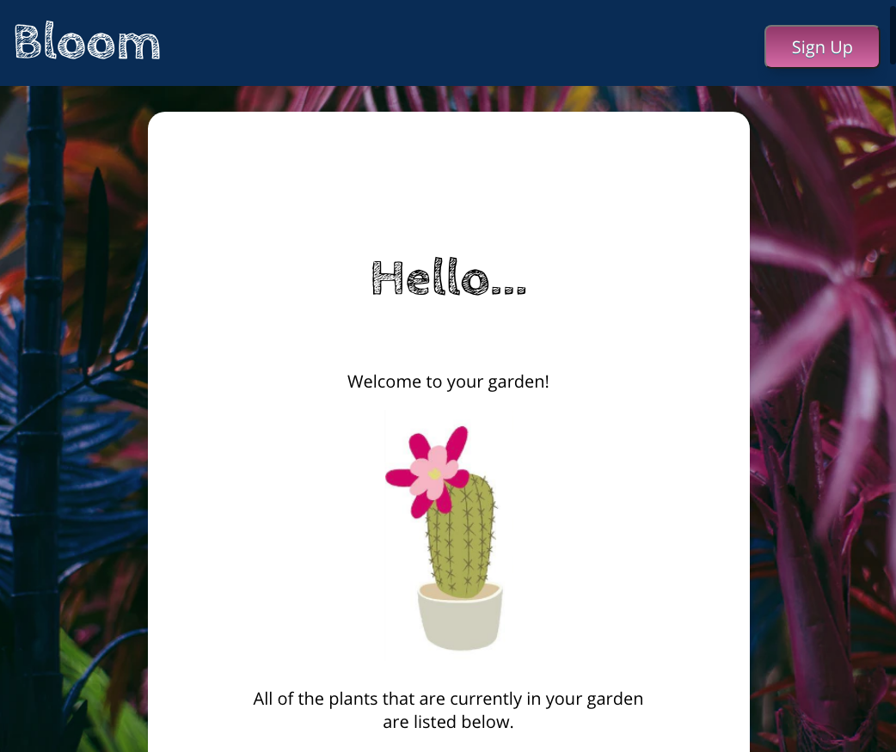
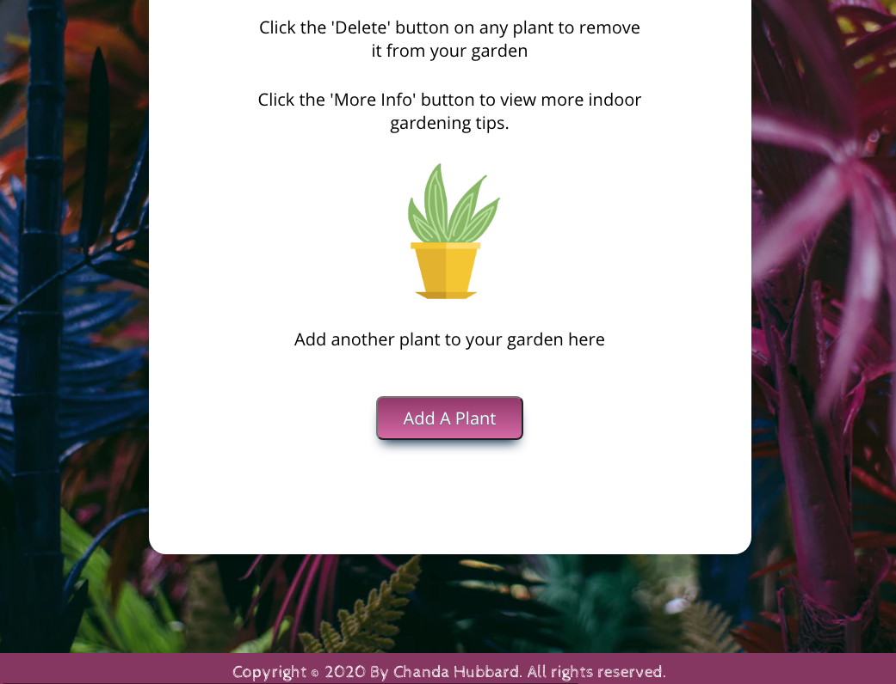

#### Signup Button

- From the landing page click the signup button to view a signup alert.  
- From there you can leave your email address to be notified of future app updates.  
- This alert was created with <b>Sweet Alerts</b>

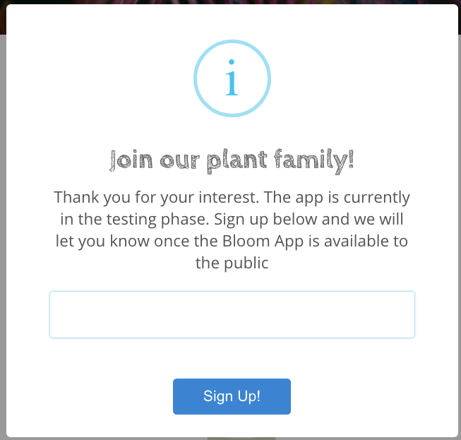

#### View your garden screen

- From the landing page click the <b>View Your Garden</b> button to navigate to the `/view` page.  
- On this page a list of plants can be viewed through <b>CSS carda</b> that renders a database of plants which were created with <b>PostgreSQL</b>.  
- The database is pre-populated with default plants.  
- Click the <b>More Info</b> button to navigate to the `/information` page.
- Plants can be added with the <b>Add A Plant</b> button and then the app will navigate to the add a plant page.

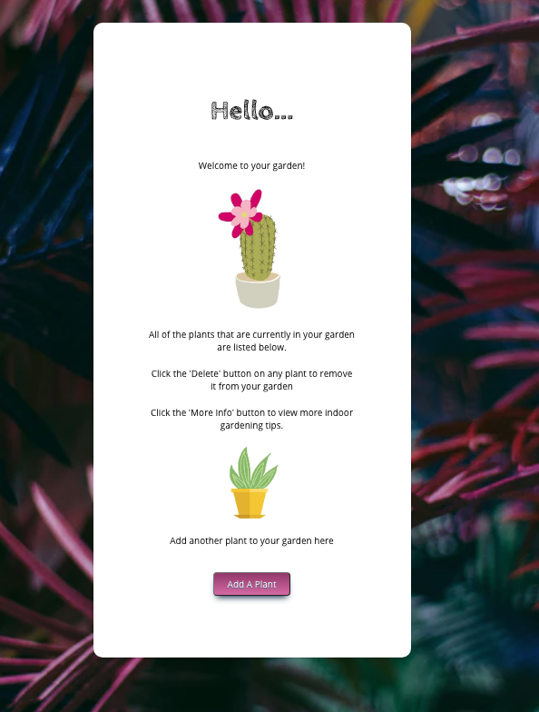
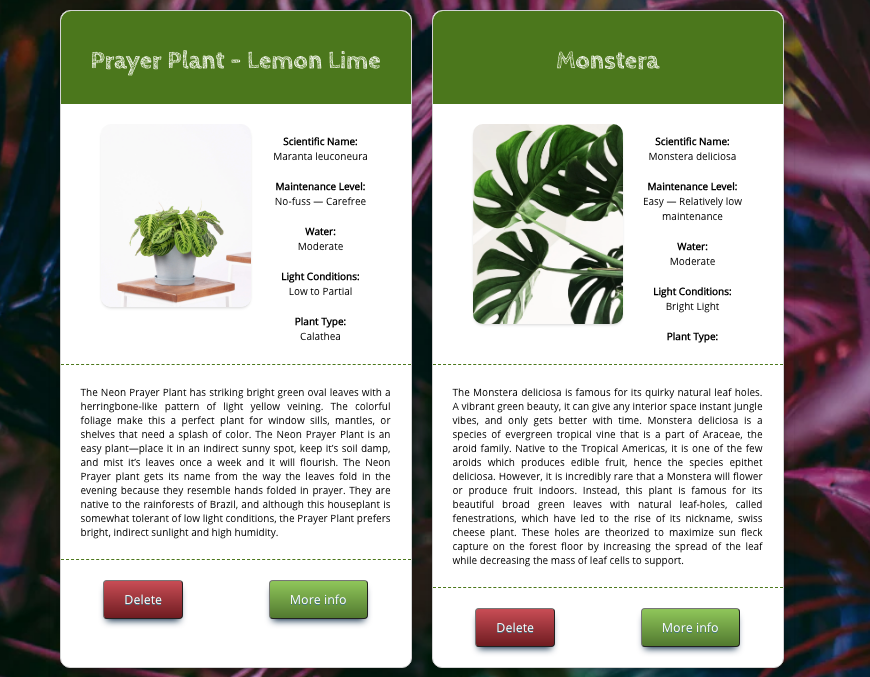

- Click the <b>Delete</b> button to remove a plant.
    - Once the  <b>Delete</b> button has been clicked you will see an alert to confirm that you would like to delete the plant
    - This alert was created with <b>Sweet Alerts</b>
    
    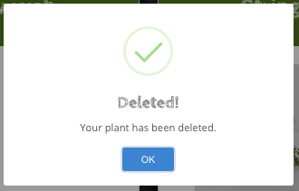

#### Add a plant screen

- Once the <b>Add A Plant</b> button is clicked the app navigates to the `/add` page
- Enter information for the new plant in the form and click the <b>Add Plant!</b> button
- The <b>View Your Garden</b> button can be clicked to navigate back to the `/view` page

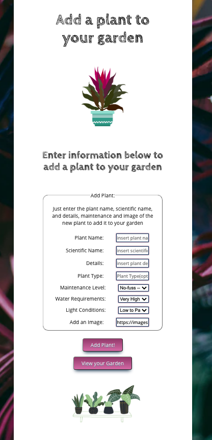

- Once the <b>Add Plant!</b> button has been click an alert will appear to let you know that the plant has been created. 
    - This alert was created with <b>Sweet Alerts</b>
    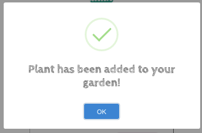

- You can then navigate back to the `/view` screen to view the new plant that was created

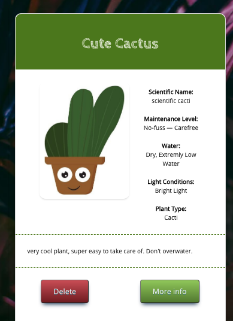

#### Plant Care Page

- From the `/view` page you can select the <b>More Info</b> button to navigate to the `/information` page
- This page provides general information about how to care for your plants
- On this page you can select the <b>View your Garden</b> button to navigate back to the `/view` page

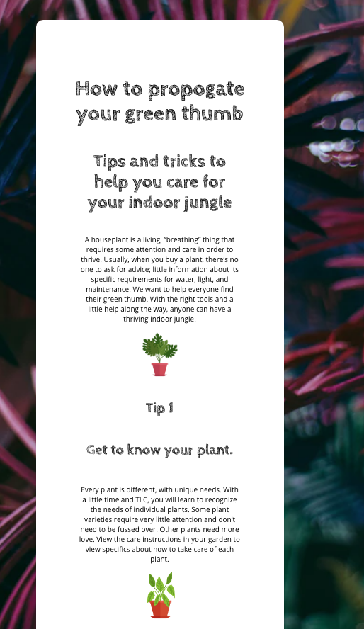
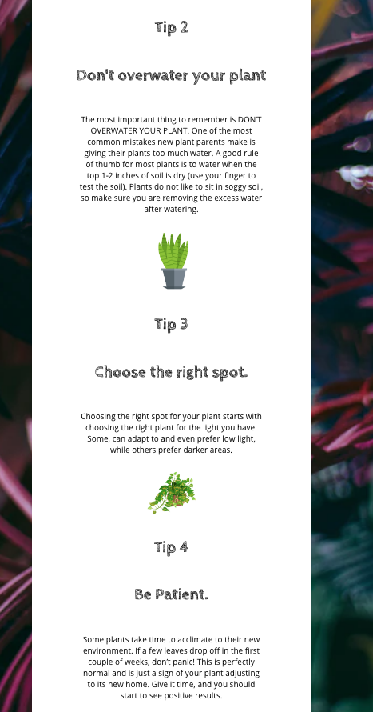

#### Not Found screen

- If the user tries to navigate to a page that does not have a route `/*` the Not Found page will be displayed
- This feature was created with <b>React Router</b>

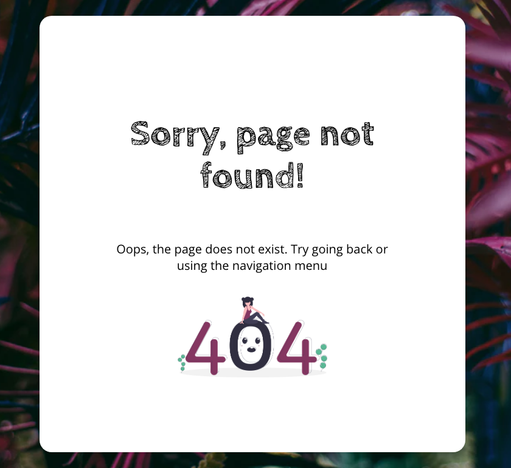

# 

## Bloom API

Link to the [API Repo](https://github.com/ChandaHubbard/bloom-api)  with API Documentation

# 

## Other features to implement in future versions

[ ] Incorporate the `/PATCH` endpoint into the client. 

[ ] Add Bootstrap

[ ] Add react-burger-menu

<!-- [ ] 
[ ] 
[ ] 
[ ]  -->
